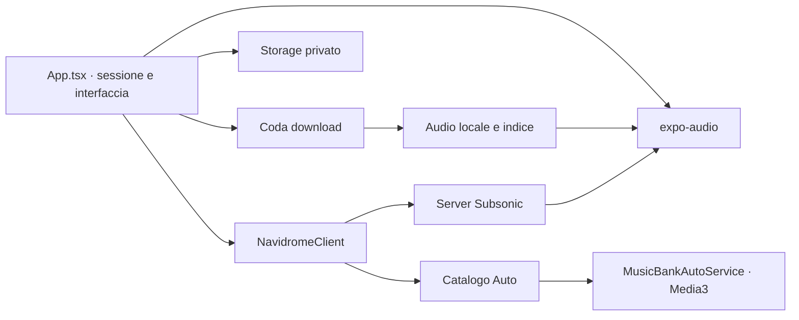

# Architettura

Music Bank è un client: il backend è il server musicale dell'utente. Non contiene
un servizio cloud proprietario né un database server da distribuire.

| Percorso | Responsabilità |
| --- | --- |
| `App.tsx` | Schermate, navigazione, sessione, player e coordinamento; ancora un file ampio da rifattorizzare con attenzione. |
| `src/subsonic/` | Tipi di dominio, API, token/salt, streaming e immagini. |
| `src/storage/` | Credenziali, catalogo, cronologia, preferenze, download e catalogo Auto. |
| `src/utils/` | Ricerca, saluto/URL, banner, identità e coda download. |
| `modules/gio-equalizer/` | Migrazione/rimozione credenziali Android legacy. Il nome è storico, non implica un equalizzatore attivo. |
| `android/app/src/main/java/` | Activity/Application e servizio Media3 per Android Auto. |
| `tests/` e `tools/` | Test, mock e strumenti di manutenzione/rilascio. |

La bozza delle credenziali è separata dall'account autenticato. Il logout protegge
dai risultati asincroni della sessione precedente e mantiene i download.
La chiave di un download include server, account e ID. La coda è seriale, deduplicata
e continua dopo un errore. File temporanei vengono validati prima del salvataggio;
file mancanti/troncati vengono esclusi al caricamento dell'indice.

La coda vive nel processo dell'app, non sopravvive garantitamente alla terminazione.
Il servizio Auto usa un catalogo con URL remoti, non la stessa coda offline.
HTTPS e SecureStore proteggono aspetti diversi: anche gli URL possono contenere
token sensibili. Dettagli in [PRIVACY.md](PRIVACY.md).
